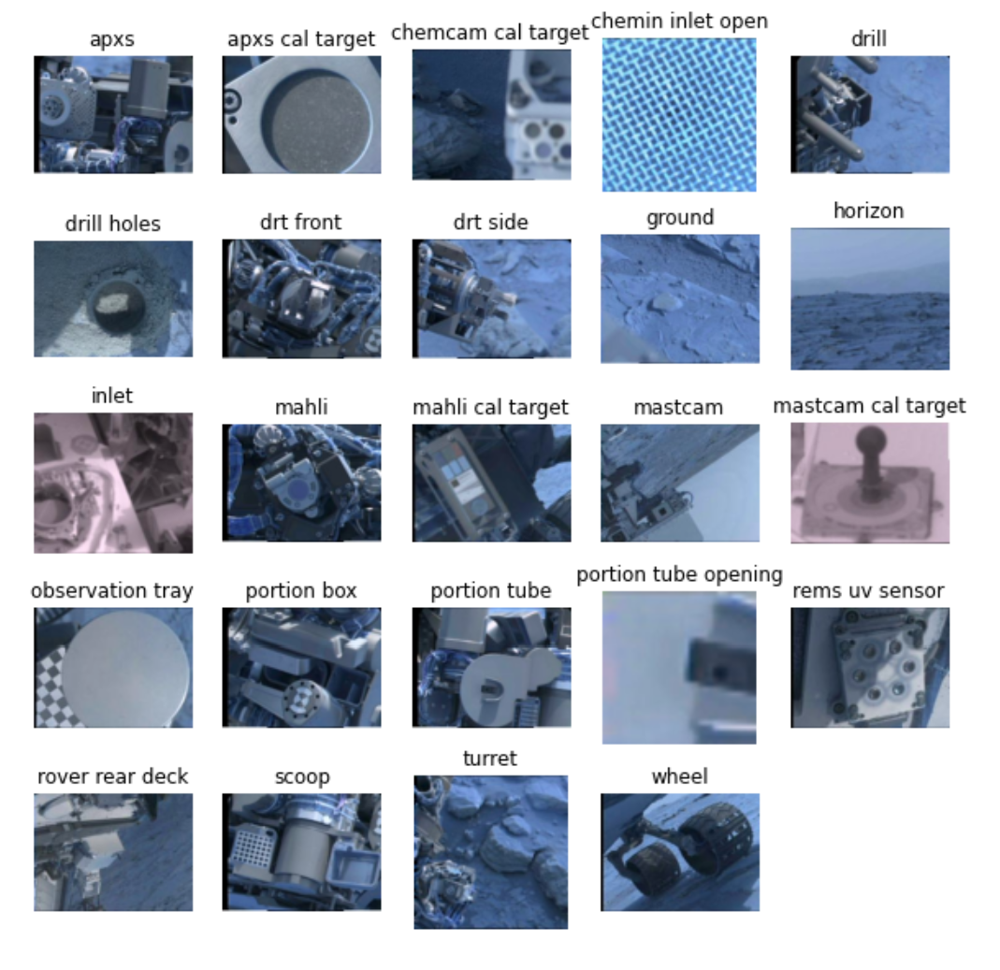

# "Curiosity" Mars Rover Images Classification

----------

[Mars Curiosity Rover](https://mars.nasa.gov/msl/home/)
----------

## Introduction
Project for the multiclass classification algorithm for Mars Rover cameras images, provides a solution for identifying different types of objects like Mars landmarks and rover parts. Model uses ResNet50 as the backbone architecture to classify images into multiple categories with 96% test accuracy. The code is designed to be easy to use and customizable, allowing users to adjust the parameters of the algorithm to achieve optimal performance.

## Data
This dataset consists of 6691 images spanning 24 classes that were collected by the Mars Science Laboratory (MSL, Curosity) rover by three instruments (Mastcam Right eye, Mastcam Left eye, and MAHLI). Dataset is available on the NASA website [here](https://data.nasa.gov/Space-Science/Mars-surface-image-Curiosity-rover-labeled-data-se/cjex-ucks).

Downloaded datasets should be in directory data/.   
Required directory stucture:

    ├── train-calibrated-shuffled
    ├── test-calibrated-shuffled
    ├── val-calibrated-shuffled
    ├── msl_synset_words-indexed
    └── calibrated
        ├── 0003ML0000000110100031E01_DRCL
        ├── 0003ML0000000110100031I01_DRCL
        ├── 0003ML0000000120100032E01_DRCL
        └── ...

## CATEGORIES

##  Dependencies
Main libraries used in this project:
* `torch == 2.0.0`
* `torchvision == 0.15.1`
* `numpy == 1.21.4`
* `pandas == 1.4.4`
* `Pillow == 9.5.0`
For the rest of the dependencies take a look at requirements.txt.

## License
Project is licensed under the MIT License - see the LICENSE.md file for details
